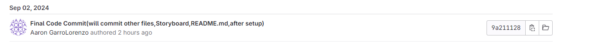

# Vacation Picker Mobile Application

**Course:** D308 - Mobile Application Development  
**Author:** Aaron Garro Lorenzo

## Purpose of the Application

This mobile application allows users to plan vacations and manage excursions according to their individual scheduling and travel preferences.

## Rubric Showcase

### Step A: GitLab Repository

**Subgroup and Project:** StepA1-Subgroup  
  
**GitLab Link:** [View Repository](https://gitlab.com/wgu-gitlab-environment/student-repos/agarrol/d308-mobile-application-development-android/-/commits/working_branch?ref_type=heads)  
**Android Target APK Version:** #15

### Step B1: Functional Requirements

1. **Install the APK:** Install the APK on an Android device supporting APK version 15 or higher.
2. **Launch the App:** Open the app, which will display a screen with an "Enter" button in the center.
3. **Vacation List Screen:** Click "Enter" to access the Vacation List screen.
    - Any previously created vacations will be listed here.
    - Clicking a vacation will allow you to edit its details.
    - If no vacations are listed, no vacations have been created yet.
4. **Create a New Vacation:** Click the "+" button on the bottom right to create a new vacation.
    - **Note:** If a vacation has an associated excursion, you must delete the excursion before deleting the vacation.

### Step B2, B3A, & B3B: Vacation Details, Creation, and Editing

1. **Vacation Details Screen:** After selecting the "+" button or choosing an existing vacation, you'll be directed to the Vacation Details screen.
    - For new vacations, fields will be blank; for existing ones, fields will show current data.
2. **Fields to Enter:** Enter the vacation title, hotel, and start/end dates. Use the date buttons to pick dates.
3. **Ellipsis Menu:** In the top right corner, the ellipsis menu allows you to:
    - Save/Update
    - Delete
    - Share Vacation
    - Set Vacation Alerts

### Step B3C: Vacation Date Validation

- **Date Validation:** If the end date is set before the start date, a toast message will notify you that the end date must be after the start date. The invalid date will be reversed, and saving the vacation will not be possible until the dates are corrected.

### Step B3E: Vacation Alerts

- **Setting Alerts:** To set a notification for the vacation start or end:
    - Click the ellipsis in the top right and choose "Vacation Start Alert" or "Vacation End Alert."
    - A notification will be triggered on the chosen date(s).

### Step B3F: Sharing Features

- **Sharing Details:** Share vacation details by selecting "Share Vacation" from the ellipsis menu. This will copy the vacation and excursion details for sharing or saving.

### Step B3G, B3H & B4: Excursion Creation, Editing, and Management

1. **Adding Excursions:** Click the "Add excursion" "+" button on the vacation details screen to open the Excursion Details screen.
    - Enter the excursion title and price, and choose a start date.
    - If the date falls outside the vacation's timeframe, a toast warning will prevent the excursion from being saved.
2. **Editing Excursions:** Click the excursion in the vacation details list to update the fields.

### Step B5: Interface Requirements

- **Detailed View:** The app provides a detailed view of excursions with title, price, and date fields.
- **Management:** Users can create, edit, and delete excursions.
- **Date Validation:** Date format validation ensures excursions occur within the vacation's timeframe.

### Step C: Screen Layouts

- **Screen Design:** The application contains well-designed screens with appropriate graphical user interface elements for each layout described in part B.

### Step D: Storyboard

- **Storyboard:** A full storyboard demonstrates the flow of the application, including all menus and screens.  
  

### Step E: Screenshots

- **Screenshots:** Screenshots of the APK are provided in the `docs` folder under `Sign your APK-Aaron Garro Lorenzo.docx`.

### Step F: README File

This file includes:
- The title and purpose of the application.
- Instructions for operating the application and addressing rubric steps.
- Information on the signed APK version and deployment.
- A link to the GitLab repository (as shown above).

